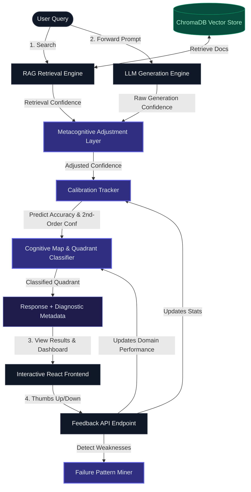

# ◆ PRISM RAG Platform
> **P**latform for **R**etrieval-augmented generation with **I**nteractive **S**elf-aware **M**etacognition

[](https://fastapi.tiangolo.com/)
[](https://reactjs.org/)
[](https://vitejs.dev/)
[](https://www.trychroma.com/)
[](https://openai.com/)
**PRISM** is a cutting-edge Retrieval-Augmented Generation (RAG) platform designed to bridge the gap between LLM hallucination and system self-awareness. By layering a metacognitive evaluation engine over retrieved context and generation confidence, PRISM dynamically assesses the reliability of its responses, visualizes its own cognitive health in real-time, and calibrates itself based on interactive user feedback.


---

## 🔍 Visualizing the Cognitive Lifecycle



---

## ⚡ Core Features
### 1. Metacognitive Confidence Adjustment
LLMs are notoriously overconfident, even when wrong. PRISM mitigates this by scaling the raw LLM confidence using the RAG retrieval quality score:
$$\text{Confidence}_{\text{adjusted}} = \text{Confidence}_{\text{raw}} \times \left(0.5 + 0.5 \times \text{Confidence}_{\text{retrieval}}\right)$$
This ensures that answers backed by rich, highly relevant local context are prioritized, while answers relying on sparse retrieval are flagged as low confidence.


### 2. The Rumsfeld / Johari Matrix Classification
Every query is categorized into one of four cognitive quadrants, inspired by the Johari Window and Rumsfeld's "Knowns/Unknowns" matrix:
*   🟢 **KNOWN_KNOWN (Verified Truth)**: High Confidence $\ge 60\%$, High Accuracy $\ge 60\%$. Safe and verifiable information.
*   🔵 **KNOWN_UNKNOWN (Cautious Competence)**: Low Confidence $< 60\%$, High Accuracy $\ge 60\%$. The system provides a correct response but remains conservative.
*   🔴 **UNKNOWN_KNOWN (Danger / Hallucination)**: High Confidence $\ge 60\%$, Low Accuracy $< 60\%$. The system is confident but wrong. Highly critical.
*   🟡 **UNKNOWN_UNKNOWN (Self-Aware Ignorance)**: Low Confidence $< 60\%$, Low Accuracy $< 60\%$. The system knows it does not know.

### 3. Interactive Closed-Loop Calibration
When users query the platform, they can provide binary feedback (👍/👎). This active signal recalibrates the **Calibration Tracker**, updating:
*   **Calibration Curve**: Plots the correlation between confidence buckets and actual accuracy.
*   **Expected Calibration Error (ECE)**: Measures the average mismatch between confidence and accuracy.
*   **Second-Order Confidence (SOC)**: Determines how statistically representative the system's self-assessment is, scaling with the sample size of recorded feedback:
    $$\text{SOC} = \frac{N}{N + 10}$$

### 4. Automated Vulnerability Mining
The **Failure Pattern Miner** runs in the background to detect systematic failures, raising alerts for:
*   **Domain Weaknesses**: Categorical subjects showing failure rates higher than $30\%$.
*   **Systemic Overconfidence**: High-confidence interactions that consistently result in low accuracy.

---

## 🛠️ Tech Stack & Architecture

### Backend (`/backend`)
*   **FastAPI**: Ultra-fast asynchronous REST API endpoints.
*   **ChromaDB**: Native vector database used for context storage and semantic retrieval (with an automatic in-memory keyword-matching fallback if dependencies are missing).
*   **OpenAI GPT-4**: Standard LLM generation client (with a simulated Mock Mode for offline/API-key-free execution).
*   **NumPy**: Mathematical operations for calibration curve statistics.
*   **Pydantic**: Robust schema-based request validation.

### Frontend (`/frontend`)
*   **React (Vite)**: Modern, lightning-fast component assembly.
*   **Tailwind CSS**: Sleek dark-mode interface built with custom gradients and micro-animations.
*   **Recharts**: Interactive charting representing the Calibration Curve in real-time.
*   **Lucide React**: Clean vector iconography.

---

## 🚀 Getting Started

### Prerequisites
Make sure you have the following installed:
*   Python 3.10+
*   Node.js 18+ & npm

---

### Backend Installation

1. Navigate to the backend directory:
   ```bash
   cd backend
   ```

2. Create a virtual environment and activate it:
   ```bash
   # Windows (PowerShell/CMD)
   python -m venv venv
   .\venv\Scripts\activate

   # macOS/Linux
   python3 -m venv venv
   source venv/bin/activate
   ```

3. Install the dependencies:
   ```bash
   pip install -r requirements.txt
   ```

4. Create a `.env` file in the `backend/` directory:
   ```env
   # Set ONE of these. Anthropic (Claude) takes priority if both are set.
   ANTHROPIC_API_KEY=your_anthropic_api_key_here
   OPENAI_API_KEY=your_openai_api_key_here
   ```
   *Note: If neither key is provided (or both remain blank/placeholder), PRISM automatically starts in a secure **Mock Mode** for evaluation. When `ANTHROPIC_API_KEY` is set, generation runs on **Claude (`claude-opus-4-8`)**; otherwise it falls back to OpenAI GPT-4. The active provider is reported in the `/api/status` and `/api/query` responses (`provider` / `model` fields).*

5. Start the backend FastAPI server:
   ```bash
   uvicorn main:app --reload --port 8000
   ```
   The API will be available at `http://127.0.0.1:8000`. You can explore the interactive OpenAPI documentation at `http://127.0.0.1:8000/docs`.

---

### Frontend Installation

1. Navigate to the frontend directory:
   ```bash
   cd ../frontend
   ```

2. Install Node packages:
   ```bash
   npm install
   ```

3. Start the development server (configured to proxy `/api/*` requests to the backend server):
   ```bash
   npm run dev
   ```
   Open your browser and navigate to `http://localhost:5173`.

---

## 📂 Codebase Walkthrough

```bash
prism-rag-platform/
├── backend/
│   ├── main.py                  # FastAPI Application router & endpoints
│   ├── prism_engine.py          # Metacognitive pipeline orchestrator
│   ├── rag_engine.py            # ChromaDB interface / Mock text vector retrieval
│   ├── calibration.py           # Calibration Curve, ECE, and SOC calculations
│   ├── cognitive_map.py         # Quadrant mapping and Danger Zone tracking
│   ├── failure_miner.py         # Failure pattern miner and vulnerability auditor
│   ├── requirements.txt         # Backend Python packages list
│   └── .env                     # Local API keys (excluded from git)
└── frontend/
    ├── src/
    │   ├── App.jsx              # Main dashboard split layout
    │   ├── ChatWindow.jsx       # Interface for ingestion, query, and feedback
    │   ├── MetacogDashboard.jsx # Real-time Recharts visualizations and metrics
    │   ├── main.jsx             # React entry mount
    │   └── index.css            # Custom styling & Tailwind directives
    ├── tailwind.config.js       # Custom design configuration
    ├── vite.config.js           # Server port routing proxy configuration
    └── package.json             # Frontend script definitions and dependencies
```

---

## 🤝 Contributing

Contributions to PRISM are welcome! Please make sure to update tests and documentation as appropriate when submitting pull requests.

## 📄 License
This project is licensed under the MIT License.
